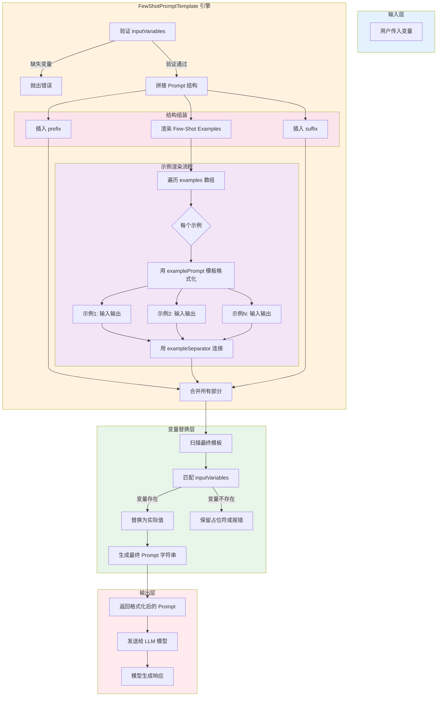

# 示例选择器（Example Selector）

## 基础用法

```javascript
import { PromptTemplate, FewShotPromptTemplate } from "@langchain/core/prompts";

const examples = [
  { input: "高兴", output: "positive" },
  { input: "难过", output: "negative" },
  { input: "平静", output: "neutral" },
];

const examplePrompt = PromptTemplate.fromTemplate(`
输入：{input}
输出：{output}
`);

const fewShotPrompt = new FewShotPromptTemplate({
  examples,
  examplePrompt,
  prefix: "判断情感倾向：",
  suffix: "输入：{input}\n输出：",
  exampleSeparator: "\n---\n",
});
```

---

## 核心流程图



---

## 核心流程说明

| 阶段 | 功能 | 关键配置 |
|------|------|----------|
| **输入层** | 接收运行时变量 | `inputVariables` 定义预期变量 |
| **prefix** | 系统指令/任务定义 | 固定文本，无变量 |
| **examples** | 提供参考样本 | `examples` 数据 + `examplePrompt` 模板 |
| **suffix** | 放置用户实际问题 | 包含 `{input}` 占位符 |
| **变量替换** | 动态注入用户输入 | 匹配 `inputVariables` 与传入对象 |
| **输出层** | 生成最终 Prompt 给模型 | 完整上下文 + 问题 |
